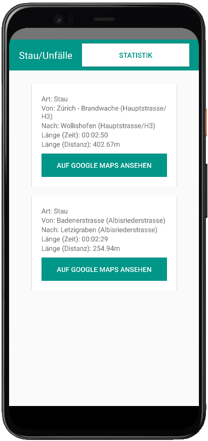
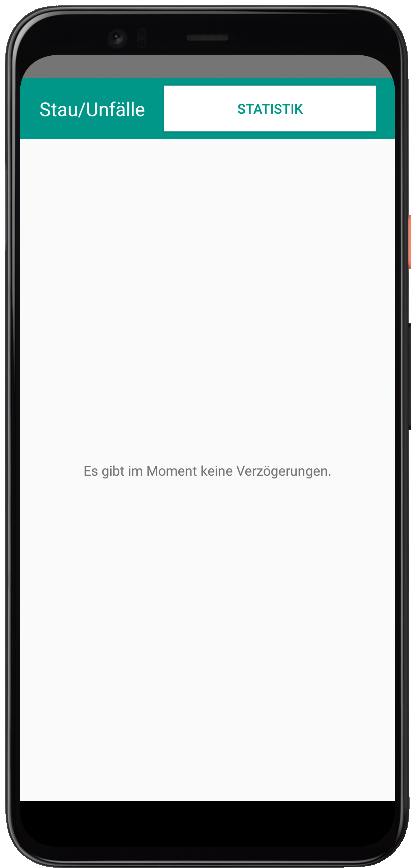
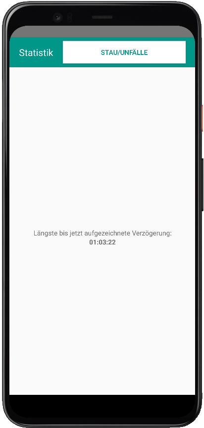

# Beschreibung
Mit StauZueri lassen sich jegliche Verzögerungsmeldungen im Umfeld der Stadt Zürich effizient einsehen. Die Verzögerungen werden so sortiert, dass die fatalsten Verzögerungen auf einen Blick erkannt werden können. Der Standort der Verzögerung kann komfortabel auf Google Maps angeschaut werden.

# Bilder

